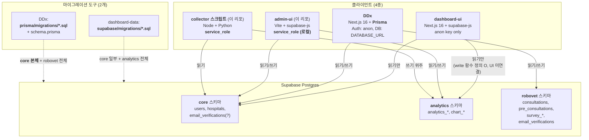
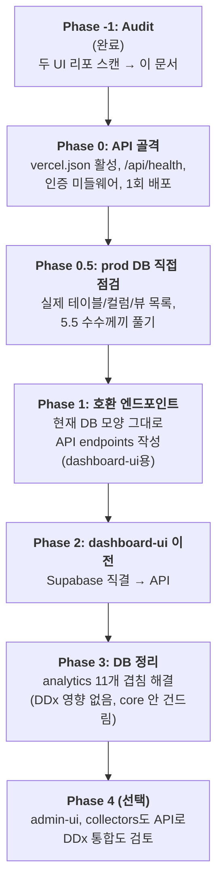

# DB 정리 프로젝트

> 이 문서는 **DB 정리 작업의 단일 컨텍스트 저장소**입니다.
> 새 채팅에서 시작할 때는 이 파일부터 읽으면 따라잡을 수 있습니다.
> 결정/사실/시안은 모두 여기에 누적합니다. 채팅은 토론장일 뿐 휘발됩니다.

---

## 1. 한 줄 요약

DB 모양이 시간이 지나며 엉망이 되어(중복 필드, 다중 쓰기 경로, 도구 분기) 정리한다. 두 UI(`dashboard-ui`, `DDx`)가 깨지지 않도록 **API 레이어를 먼저 도입**한 뒤 그 위에서 안전하게 DB를 정리한다.

## 2. 왜 정리하는가 (사용자 표현)

- "DB가 많이 엉망인거같음"
- "중복된 필드값도 있는거같음"
- "서로 다른 ui에서 write가 되면서 꼬이기도 함"
- → DB 정리부터 먼저 하고 싶다

## 3. 시스템 현재 상태 (전체 그림)



## 4. 리포별 audit 요약

### 4.1 dashboard-data (이 리포)

- **역할**: DB 마이그레이션, collector 스크립트, 로컬 admin-ui
- **DB 접근 도구**: `@supabase/supabase-js` (PostgREST)
- **마이그레이션**: [supabase/migrations/](../supabase/migrations) + [supabase/schema.sql](../supabase/schema.sql)
- **네 종류 코드**:
  - 옛 collector: [index.js](../index.js) → `analytics.analytics_daily_metrics` (long format, 폐기 후보)
  - 새 collector: [scripts/collect-blog-metrics.js](../scripts/collect-blog-metrics.js), [scripts/collect-smartplace-inflow.js](../scripts/collect-smartplace-inflow.js) → `analytics.analytics_blog_daily_metrics`, `analytics.analytics_smartplace_daily_metrics`
  - 순위 collector: [scripts/naver-rank-main.py](../scripts/naver-rank-main.py) → `analytics.analytics_blog_keyword_ranks`, `analytics.analytics_place_keyword_ranks`
  - 광고 collector: [scripts/naver-searchad-main.py](../scripts/naver-searchad-main.py), [scripts/googleads-collect-main.js](../scripts/googleads-collect-main.js)
  - 로컬 UI: [admin-ui/src/App.jsx](../admin-ui/src/App.jsx) → 병원/키워드/광고계정 관리, chart 엑셀 업로드
- **Vercel 배포**: [vercel.json](../vercel.json)이 `ignoreCommand`로 빌드 막아둠 (현재 미배포)
- **`upsertHospitalWithCompat`** (admin-ui App.jsx L89~) → `createdAt`/`created_at` 등 5종 양식을 차례로 시도. **DDx Prisma의 camelCase 컬럼에 맞춰주려는 흔적**.

### 4.2 dashboard-ui (`C:\Projects\dashboard-ui`)

- **역할**: 병원 마케팅 KPI 시각화 (메인 사용자 화면)
- **스택**: Next.js 16, React 19, TypeScript, `@supabase/supabase-js` ^2.103, `@supabase/ssr` (createBrowserClient)
- **DB 키**: `NEXT_PUBLIC_SUPABASE_ANON_KEY` only (service_role 미사용)
- **인증**: Supabase Auth (`signInWithPassword`)
- **모든 DB 호출이 한 파일에 집중**: `C:\Projects\dashboard-ui\src\lib\queries.ts`
- **읽는 객체**:
  - `core.users` — `id, "hospitalId", name` (camelCase 따옴표!)
  - `core.hospitals` — `id, name, naver_blog_id, address`
  - `analytics.chart_kpis_period_view`
  - `analytics.chart_blog_period_view` ← **이 리포 마이그레이션에 정의 없음**
  - `analytics.chart_place_period_view` ← **이 리포 마이그레이션에 정의 없음**
  - `analytics.analytics_blog_keyword_ranks_daily_view`
  - `analytics.analytics_place_keyword_ranks`
  - `analytics.analytics_smartplace_daily_metrics` (fallback)
- **쓰기**: 함수는 정의됨(`insertKeywordTarget`, `updateKeywordTarget`, `deleteKeywordTarget` on `analytics_blog_keyword_targets`) 그러나 **현재 어떤 화면도 호출 안 함**
- **RPC/Edge Functions**: 없음
- **`isAdmin = false` 고정** → 관리자 분기 사실상 비활성

### 4.3 DDx (`C:\Projects\DDx`)

- **역할**: RoboVet AI — 수의사 문진 / 감별진단(DDx) / 사전문진 / Tally 연동
- **스택**: Next.js 16, React 19, TypeScript, **Prisma 7.4** + `@prisma/adapter-pg` + `pg`
- **DB 접근 패턴**: 모든 테이블 CRUD = Prisma. `@supabase/supabase-js`는 **Auth, Auth Admin, Realtime** 만 사용 (PostgREST `.from()/.rpc()` 미사용)
- **인증**: Supabase Auth (이메일/비밀번호) + 자체 승인 플로우(`approved`, `active`, soft delete)
- **관리자**: `ADMIN_EMAILS` 환경변수와 `core.users.email` 매칭
- **Realtime**: `monitor` 페이지에서 `postgres_changes`에 `schema: 'public'` 사용 → 실제 테이블은 `robovet.consultations` → **이벤트 안 옴 가능성** (잠재 버그)
- **마이그레이션**: `C:\Projects\DDx\prisma\migrations\*.sql` + `prisma/schema.prisma`
  - `prisma/schema.prisma`에 `schemas = ["core", "robovet"]` + `@@schema(...)`
  - 초기 SQL 일부는 스키마 접두사 없이 `public`에 만들었을 가능성
- **외부 통합**: Google Gemini, OpenAI Whisper, Resend, Tally webhook
- **소유 테이블** (Prisma 모델 → DB):
  - `core.hospitals` — name, address, logoUrl 등 (DDx가 admin CRUD)
  - `core.users` — 가입/승인/소프트삭제 (DDx 본체)
  - `robovet.pre_consultations` — Tally 사전문진
  - `robovet.consultations` — sessionId, transcript, summary, ddx, cc
  - `robovet.email_verifications` — 가입 이메일 인증
  - `robovet.survey_templates` (코드 미사용 — 정리 후보)
  - `robovet.survey_sessions`
  - `robovet.survey_question_instances`
  - `robovet.survey_answers`
- **camelCase**: Prisma 모델·DB 컬럼 모두 camelCase (`hospitalId`, `tallyResponseId` 등)

## 5. 발견된 큰 사실들 (audit이 드러낸 것)

### 5.1 두 ORM이 같은 DB를 두드림
- PostgREST: dashboard-ui, admin-ui, collectors
- Prisma: DDx
- → 쓰기 정합성 강제 어려움

### 5.2 두 마이그레이션 도구
- `supabase/migrations/*.sql` (이 리포)
- `prisma/migrations/*.sql` + `schema.prisma` (DDx 리포)
- → `core.*`를 양쪽이 동시에 건드림 → drift

### 5.3 컬럼 네이밍이 camelCase (core·robovet)
- DDx Prisma가 `core.users`, `core.hospitals` 본체를 만들었고 컬럼이 camelCase
- 증거 1: dashboard-ui가 `core.users."hospitalId"` (quoted) 조회
- 증거 2: admin-ui가 `createdAt`/`created_at` 5종 시도 (camel/snake 둘 다 시도)
- 증거 3: 우리 [supabase/schema.sql L353](../supabase/schema.sql) 가 `hospital_id` (snake) 추가 시도 → **두 컬럼이 동시 존재 가능**

### 5.4 `email_verifications` 두 군데 동시 존재 가능
- dashboard-data [schema.sql L8~](../supabase/schema.sql) → `public.email_verifications` → `core.email_verifications` 이동 시도
- DDx Prisma → `robovet.email_verifications` 정의
- → 같은 이름 테이블 2개 스키마에 따로 있을 수도

### 5.5 dashboard-ui가 마이그레이션에 없는 뷰를 읽음
- `analytics.chart_blog_period_view`
- `analytics.chart_place_period_view`
- 우리 마이그레이션 검색 결과 정의 없음
- → Supabase 콘솔 직접 작성 또는 마이그레이션 누락 (수수께끼, 추후 prod DB 직접 점검 필요)

### 5.6 스키마별 진짜 소유자

- **`core.users`** — 정의: DDx Prisma. 컬럼 추가: dashboard-data가 `role`, `hospital_id` (snake) 추가 시도 (drift 위험)
- **`core.hospitals`** — 정의: DDx Prisma. 컬럼 추가: dashboard-data가 `naver_blog_id`, `smartplace_stat_url`, `debug_port` (snake) 추가 시도 (drift 위험)
- **`core.email_verifications`** — 모호함 (위 5.4 참조)
- **`analytics.*`** — dashboard-data 단독 (DDx 영향 없음)
- **`robovet.*`** — DDx 단독 (우리가 손 안 대면 됨)

## 6. 11개 겹침 카탈로그 (analytics 스키마 한정)

| # | 무엇 | 어디 | 위험 | 비유 |
|---|---|---|---|---|
| 1 | `hospital_name` 비정규화 | analytics_daily_metrics, analytics_blog_daily_metrics, analytics_smartplace_daily_metrics, analytics_blog_keyword_ranks | 중 | 병원이 이름 바꾸면 옛 데이터는 옛 이름 그대로 |
| 2 | `account_id`(=naver_blog_id) 비정규화 + 키화 | 5개 테이블 PK/UNIQUE에 박힘 | **상** | 블로그ID가 도장 역할까지 함, 바뀌면 옛 데이터 미아 |
| 3 | `customer_id`(광고계정) 비정규화 | searchad/googleads 일별 지표 (계정함과 별도 보관) | 중 | 광고 일별 데이터가 계정함과 안 묶임 |
| 4 | **같은 일별 지표 두 캐비닛** (legacy + new) | analytics_daily_metrics ↔ analytics_blog_daily_metrics + analytics_smartplace_daily_metrics | **상** | 옛 종합장부 + 새 분리장부 수집기 둘이 갈라져 씀 |
| 5 | 보호자/동물 이름 3중 저장 | chart_transactions_raw + chart_customer_master(_latest) + chart_customer_patients(patient_name_latest) | 중 | rebuild 안 돌면 stale |
| 6 | 시간 컬럼 이름 제각각 | created_at/updated_at/ingested_at/collected_at/started_at/finished_at + camelCase 잔재 | 하 | admin-ui가 5종 양식 시도 |
| 7 | `source` 컬럼 의미 혼재 | analytics_daily_metrics(채널) vs *_targets(입력경로) | 중 | 같은 컬럼명, 다른 의미 |
| 8 | `metadata` vs `raw_payload` 구분 없음 | 거의 모든 테이블 | 하 | 거의 다 빈 `{}` |
| 9 | chart_transactions_raw 잠금장치 3개 | (file_hash, row_no), (row_signature), (dedupe_key) UNIQUE 3개 | 하 | 어떤 자물쇠에 걸렸는지 불명 |
| 10 | 키워드 타깃 중복키 기준 다름 | blog: (account_id, keyword) vs place: (hospital_id, keyword) | **상** | 같은 의도, 다른 키 → 중복 row 위험 |
| 11 | 옛 KPI 컬럼명(`new_patient_count`) [schema.sql](../supabase/schema.sql) 잔존 | schema.sql vs 실제 (rename됨) | 하 | 새 환경 셋업 시 안 맞음 |

## 7. 결정 로그

- ✅ **[2026-05-03] analytics 스키마는 wipe해도 됨** — 데이터는 collector 재실행/엑셀 재업로드로 복구 가능. core·robovet 데이터는 보존 필수.
- ✅ **[2026-05-03] API 레이어 도입 결정** — 두 UI(dashboard-ui, DDx)와 DB 사이에 API를 두어 DB 정리 시 UI 영향 차단.
- ✅ **[2026-05-03] API 위치/스택**: 이 리포(`dashboard-data`)에 Vercel 서버리스로 함께. (참고: 별도 리포로 분리는 보류)
- ✅ **[2026-05-03] DDx의 데이터 사용처**: `core` + `robovet` 스키마. analytics는 안 씀.

## 8. 미결정 / 열린 질문

### 8.1 (큼) 마이그레이션 도구 일원화
DDx Prisma + dashboard-data SQL 마이그레이션이 같은 `core.*` 를 건드림. 옵션:
- **A**: 모든 스키마를 Prisma로 일원화 (dashboard-data가 Prisma 도입)
- **B**: 모든 스키마를 SQL 마이그레이션으로 일원화 (DDx가 Prisma migrate 끄고 SQL 채택)
- **C**: 스키마별로 소유자 명확화 — `core` + `robovet` = DDx/Prisma, `analytics` = dashboard-data/SQL. 한쪽이 다른 쪽 영역 절대 손대지 않기.
- 현 추천: **C** (재작업 최소, 책임 명확)

### 8.2 (큼) 컬럼 네이밍 표준
- 옵션 1: 새 analytics는 snake_case, core/robovet은 camelCase (현재 사실상 그러함, 분리)
- 옵션 2: 모든 스키마 snake_case로 통일 (core 변경 비용 큼, dashboard-ui도 같이 변경)
- 현 추천: **옵션 1** (각 영역 내부 일관성만 강제)

### 8.3 단일 API vs 두 API
- 추천: 단일 API + 경로 분리 (`/api/dashboard/*`, `/api/ddx/*`, `/api/admin/*`)

### 8.4 인증 방식
- 추천: Supabase Auth JWT 검증을 API에서 (현 두 UI 모두 Supabase Auth 사용)

### 8.5 API 도입 범위
- 추천: dashboard-ui + admin-ui + collectors 만 API로. **DDx는 당분간 Prisma 유지**(Next.js 내 API 라우트 + Prisma 패턴이 이미 견고함). → 나중에 단계적 통합 검토.

### 8.6 chart_* 데이터 정책
- analytics 정리 시 chart_* 도 wipe하고 엑셀 재업로드로 복구할지 OK?

### 8.7 미정의 뷰 수수께끼
- `chart_blog_period_view`, `chart_place_period_view` 정의 어디?
- → Phase 0 또는 Phase 1 들어가기 전에 prod DB 직접 점검 필요

### 8.8 FK on delete
- 병원 삭제 시 그 데이터 cascade vs restrict?

### 8.9 Vercel 배포 도메인
- 기본 `*.vercel.app` 사용 vs 커스텀 도메인?

## 9. 진행 단계 (Phase)



## 10. 다음 액션 (당장 해야 할 것)

1. **8.1, 8.2, 8.3, 8.5 결정** (가장 큰 자물쇠 4개) — 사용자 답변 필요
2. 결정 후 **Phase 0 착수** 가능
3. Phase 0 끝나면 **Phase 0.5 (prod DB 점검)** 으로 미정의 뷰/drift 확인

## 11. 참고 / 외부 링크

- 이 리포 README: [README.md](../README.md)
- IntoVet handoff 문서: [INTOVET_HANDOFF_2026-04-21.md](../INTOVET_HANDOFF_2026-04-21.md)
- 관련 별도 리포:
  - `C:\Projects\dashboard-ui` (병원 KPI 시각화)
  - `C:\Projects\DDx` (RoboVet AI)

## 12. Q&A 노트 (개념 설명)

> 작업 진행 중 사용자가 던진 질문과 답변을 누적합니다.
> 결정의 *근거*가 되는 개념·맥락을 보존해서, 새 채팅에서도 같은 설명을 반복하지 않게 합니다.

### Q1 (2026-05-03). Prisma와 SQL의 차이가 뭐야?

**A. 한 줄**: SQL은 DB가 직접 알아듣는 명령문을 손으로 쓰는 방식, Prisma는 우리가 알기 쉬운 모양 정의서를 쓰면 도구가 자동으로 SQL을 생성해주는 방식.

**예시 비교** — 같은 "병원 테이블 만들기" 작업:

SQL 방식 (dashboard-data가 사용):
```sql
create table if not exists core.hospitals (
  id text primary key,
  name text not null,
  naver_blog_id text,
  created_at timestamptz not null default now(),
  updated_at timestamptz not null default now()
);
```

Prisma 방식 (DDx가 사용):
```prisma
model Hospital {
  id            String   @id
  name          String
  naverBlogId   String?  @unique
  createdAt     DateTime @default(now())
  updatedAt     DateTime @updatedAt
  @@map("hospitals")
  @@schema("core")
}
```

**비유**:
- SQL = 건물을 직접 벽돌 하나하나 쌓기 (자유도 100%, 손이 많이 감)
- Prisma = 이케아 조립도 그리듯이 그림으로 그리기 (도구가 망치질 자동화, 단 고급 기능은 한계)

**비교표**:

| 항목 | SQL | Prisma |
|---|---|---|
| 자유도 | 100% — DB의 모든 기능 | 80% — 흔한 기능만 |
| 코드와 연결 | 별도 관리 | 자동 (TypeScript 타입 자동 생성) |
| 뷰/RLS/트리거/RPC | 자유롭게 정의 | 거의 못 함 → 결국 SQL 같이 써야 함 |
| 학습 곡선 | DB 지식 필요 | 비교적 쉬움 |

**우리 상황에서 중요한 점**:
- 우리 DB의 고급 기능(`chart_kpis_period_view`, RLS 정책 수십 개, `rebuild_chart_for_run` RPC, `trg_*_updated_at` 트리거 등)은 **Prisma로 만들기 어려움**. 모두 Prisma로 일원화한다 해도 결국 SQL 따로 써야 함.
- DDx 코드는 `prisma.consultations.findMany(...)` 같이 Prisma에 깊이 의존 → 모두 SQL로 일원화하려면 거의 재작성 수준.
- 따라서 **영역별 분담(C안)** 이 재작업 최소.

**관련 결정**: §8.1 미결정 (옵션 C 추천 중)

---

### Q2 (자리만 잡아둠). [다음 사용자 질문이 들어오면 여기에 추가]

## 13. Target Schema 시안 v1 (analytics 한정)

> 사용자 요청에 따른 1차 시안. core·robovet은 DDx 소관이므로 손대지 않음.
> 미확정 결정사항이 있어 **가정**을 명시하고 진행합니다. 가정이 바뀌면 시안도 바뀝니다.

### 13.1 깔고 가는 가정

- **§8.1 = 옵션 C** (영역별 분담): core+robovet은 DDx/Prisma 단독, analytics는 dashboard-data/SQL 단독. 서로 안 건드림.
- **§8.2 = 옵션 1** (영역별 일관성): analytics는 모두 snake_case로 통일. core/robovet은 camelCase 유지(DDx 소유).
- **§8.5 = exclude_ddx**: API는 dashboard-ui + admin-ui + collectors만. DDx는 Prisma 유지.
- **§8.6 = chart_* 도 wipe OK**: 엑셀 재업로드로 복구 가능 (확정 필요)
- **§8.8 = FK on delete**: `restrict` (병원 삭제 시 데이터 안 지움, 삭제 자체를 막음 — 안전)
- 모든 `hospital_id`는 `text`(uuid 형태) — `core.hospitals.id` 와 같은 타입. FK 강제.

### 13.2 영역별 책임 (재확인)

- **core 스키마** → DDx Prisma 단독 정의/관리. 우리는 SELECT만.
  - 단, 우리가 추가하던 `naver_blog_id`, `smartplace_stat_url`, `debug_port` 컬럼은 **DDx Prisma에 추가 요청** 필요. 그 후 우리 SQL의 `add column` 시도 코드는 제거.
- **robovet 스키마** → DDx Prisma 단독. 우리는 손 안 댐.
- **analytics 스키마** → dashboard-data/SQL 단독. 새로 깨끗하게.

### 13.3 새 analytics 스키마 (테이블 목록)

#### A. 외부 채널 계정함

`analytics.searchad_accounts`
- `id` bigint identity pk
- `hospital_id` text NOT NULL → FK core.hospitals(id) ON DELETE RESTRICT
- `customer_id` text NOT NULL
- `api_license` text NOT NULL
- `secret_key_encrypted` text NOT NULL
- `is_active` bool NOT NULL default true
- `last_synced_at` timestamptz
- `created_at`/`updated_at` timestamptz default now() + trigger
- UNIQUE (hospital_id, customer_id)

`analytics.googleads_accounts`
- 동일 패턴, secret 대신 `refresh_token_encrypted`

#### B. 추적할 키워드 목록

`analytics.blog_keyword_targets`
- `id` bigint identity pk
- `hospital_id` text NOT NULL → FK core.hospitals(id) ON DELETE RESTRICT
- `keyword` text NOT NULL
- `is_active` bool NOT NULL default true
- `entry_source` text default 'admin-ui'  (옛 `source` 컬럼 의미 분리)
- `created_at`/`updated_at`
- UNIQUE **(hospital_id, keyword)** ← 옛 `account_id` 기반 폐기

`analytics.place_keyword_targets`
- 동일 패턴

#### C. 일별 마케팅 지표 (채널별 wide)

`analytics.blog_metric_daily`
- `metric_date` date NOT NULL
- `hospital_id` text NOT NULL → FK
- `blog_views` bigint
- `blog_unique_visitors` bigint
- `raw_payload` jsonb default '{}'
- `created_at` timestamptz default now()
- PRIMARY KEY (metric_date, hospital_id)

`analytics.smartplace_metric_daily`
- (metric_date, hospital_id, smartplace_inflow, raw_payload, created_at)
- PK (metric_date, hospital_id)

`analytics.searchad_metric_daily`
- (metric_date, hospital_id, customer_id, campaign_id, adgroup_id, keyword_id, impressions, clicks, cost, conversions, conversion_value, raw_payload, created_at)
- PK (metric_date, hospital_id, customer_id, campaign_id, adgroup_id, keyword_id)
- FK (hospital_id, customer_id) → searchad_accounts(hospital_id, customer_id)

`analytics.googleads_metric_daily`
- (metric_date, hospital_id, customer_id, impressions, clicks, cost_micros, raw_payload, created_at)
- PK (metric_date, hospital_id, customer_id)
- FK (hospital_id, customer_id) → googleads_accounts(hospital_id, customer_id)

#### D. 키워드 순위 시계열

`analytics.blog_rank_daily`
- (metric_date, hospital_id, keyword, section, metric_key, rank_value, exposed_url, raw_payload, created_at)
- PK (metric_date, hospital_id, keyword, section, metric_key)

`analytics.place_rank_daily`
- (metric_date, hospital_id, keyword, store_name, section, metric_key, rank_value, raw_payload, created_at)
- PK (metric_date, hospital_id, keyword, store_name, section, metric_key)

#### E. 차트(진료) — customer 기준 모델 유지하되 정리

`analytics.chart_upload_runs`
- (id pk, hospital_id FK, chart_type, source_file_name, source_file_hash, status, total_rows, imported_rows, skipped_rows, error_rows, started_at, finished_at, raw_payload)
- UNIQUE (hospital_id, chart_type, source_file_hash)

`analytics.chart_transactions`
- (id pk, run_id FK→runs, hospital_id FK→hospitals, chart_type, service_date, customer_no_raw, customer_name_raw, patient_name_raw, receipt_no_raw, treatment_content_raw, bill_no_raw, final_amount_raw, customer_key_norm, patient_key_norm, dedupe_key, raw_payload, created_at)
- UNIQUE **(hospital_id, chart_type, dedupe_key)** ← 자물쇠 1개로 축소

`analytics.chart_customers`
- (id pk, hospital_id FK, chart_type, customer_key_norm, first_visit_date, last_seen_at, is_active, raw_payload, created_at, updated_at)
- UNIQUE (hospital_id, chart_type, customer_key_norm)
- ※ `customer_no_raw_latest`, `customer_name_latest` **컬럼 제거** → 필요시 view로 노출

`analytics.chart_customer_patients`
- (id pk, hospital_id FK, chart_type, customer_key_norm, patient_key_norm, first_seen_date, last_seen_date, last_seen_at, is_active, raw_payload, created_at, updated_at)
- UNIQUE (hospital_id, chart_type, customer_key_norm, patient_key_norm)
- ※ `patient_name_latest` **컬럼 제거**

`analytics.chart_customer_identity_map` (eFriends 동명이인 처리)
- 기존과 동일 구조 유지

`analytics.chart_kpi_daily`
- (metric_date, hospital_id FK, chart_type, sales_amount, visit_count, new_customer_count, source_run_id FK→runs, raw_payload, created_at, updated_at)
- PK (metric_date, hospital_id, chart_type)

`analytics.chart_upload_errors`
- (id pk, run_id FK, hospital_id FK, chart_type, source_row_no, error_code, error_message, raw_payload, created_at)

#### F. 뷰 (대시보드용 편의)

`analytics.blog_metric_daily_view` — `core.hospitals` join, hospital_name 노출
`analytics.smartplace_metric_daily_view` — 동일
`analytics.blog_rank_daily_view` — pivoted (metric_key별 컬럼)
`analytics.chart_kpi_period_view` — day/week/month 합계 (기존 유지)
`analytics.chart_blog_period_view`, `analytics.chart_place_period_view` — **dashboard-ui가 읽는 것** → Phase 0.5에서 정의 출처 확인 후 정식 추가

#### G. 뷰 (chart customers 최근 이름 노출용)

`analytics.chart_customers_with_latest_name` — `customer_master.customer_name_latest` 대체
- `chart_transactions` 에서 customer_key별 max(created_at) 행의 customer_name_raw, customer_no_raw 노출

### 13.4 11개 겹침 → 시안에서 어떻게 해결됐나

| # | 겹침 | 해결 |
|---|---|---|
| 1 | hospital_name 비정규화 | 모든 테이블에서 컬럼 제거. 뷰에서 join |
| 2 | account_id(blog_id) 비정규화+키화 | 모든 테이블 PK/UNIQUE에서 제거. naver_blog_id는 core.hospitals에만 |
| 3 | customer_id 비정규화 | 유지하되 (hospital_id, customer_id) FK → accounts 강제 |
| 4 | 일별 지표 두 캐비닛 | analytics_daily_metrics 폐기. 채널별 wide만 |
| 5 | 보호자/동물 이름 3중 저장 | _latest 컬럼 제거. 진실은 transactions, 노출은 view |
| 6 | 시간 컬럼 이름 제각각 | created_at/updated_at 표준. ingested_at/collected_at 폐기. 업로드 메타만 started/finished_at 예외 |
| 7 | source 컬럼 의미 혼재 | 채널 의미는 테이블명으로 흡수. 입력경로는 `entry_source` |
| 8 | metadata vs raw_payload | 모두 `raw_payload`로 통일 (외부 원본). 우리 메모는 컬럼으로 명시 |
| 9 | chart raw 잠금장치 3개 | (hospital_id, chart_type, dedupe_key) 1개로 |
| 10 | 키워드 타깃 키 기준 다름 | 둘 다 (hospital_id, keyword) 통일 |
| 11 | 옛 KPI 컬럼명 schema.sql 잔존 | schema.sql 전면 재작성 |

### 13.5 마이그레이션 전략

- 새 reset 마이그레이션 1개:
  - `drop schema analytics cascade; create schema analytics;`
  - 새 테이블/인덱스/트리거/뷰/RLS/grants 일괄 생성
- 옛 마이그레이션 파일은 보관(히스토리), 삭제 안 함
- [supabase/schema.sql](../supabase/schema.sql) 전체 재작성 (새 baseline)
- DDx Prisma의 core 스키마에 우리가 쓰던 컬럼(`naver_blog_id` 등) 추가 요청 → 마이그레이션 동기화

### 13.6 API에 미치는 영향

- API 엔드포인트는 **이 새 스키마 기반으로 설계**
- 응답 JSON 모양은 dashboard-ui의 현재 사용 패턴(예: `account_id`, `hospital_name` 응답 필드)을 호환 유지하기 위해 **API 내부에서 join/계산해서 채움**
- Phase 1 (호환 엔드포인트)와 Phase 3 (DB 정리) 사이에 **API만 안에서 SQL 변경** → UI 무영향

### 13.7 RLS / 권한

- 모든 새 테이블에 RLS 활성
- SELECT 정책: `core.users.role = 'admin'` 또는 `core.users.hospital_id = 행의 hospital_id`
- INSERT/UPDATE/DELETE: 정리는 Phase 1에서 API가 service_role로 우회하는 것을 전제 → RLS는 직결 클라이언트(현 dashboard-ui anon) 보호용
- 향후 API로 모든 쓰기 모이면 RLS는 더 엄격해질 수 있음

### 13.8 미정 / 확인 필요

- DDx 측에 `core.hospitals.naver_blog_id` 등 컬럼 추가 요청 합의 필요
- chart_* 데이터 wipe 진짜 OK인지 (엑셀 다 갖고 계신지) 최종 확인
- dashboard-ui가 읽는 `chart_blog_period_view`, `chart_place_period_view` 정의 출처 확인 (Phase 0.5)
- FK on delete: `restrict` (안전) vs `cascade` (자동 정리) — restrict 가정 사용

### 13.9 다음 액션 제안

1. 이 시안 검토 → 큰 가정(13.1)에 동의/이견 표시
2. (필요시) DDx 팀에 core 컬럼 추가 협의
3. 가정 확정되면 Phase 0(API 골격) 착수 가능

---

## 14. `public` 스키마 잔여 테이블 정리 (합의: 불필요)

### 14.1 사용자 확인된 목록

`public` 에 다음 테이블이 존재함:

- `consultations`, `email_verifications`, `hospitals`, `pre_consultations`,
- `survey_answers`, `survey_question_instances`, `survey_sessions`, `survey_templates`, `users`

**사용자 판단**: `public` 스키마는 필요 없음 → 위 테이블 제거 후보.

### 14.2 주의 (삭제 전 필수)

1. **`public` 스키마 자체를 DROP 하지 말 것.** PostgreSQL/Supabase는 `public` 을 기본으로 씀. **테이블만** 정리하는 편이 안전.
2. **DDx Prisma** 가 현재 `core` / `robovet` 을 보도록 되어 있어도, 운영 DB에 **동일 이름 테이블이 `core`·`robovet` 에 실제로 있고 행이 있는지** 먼저 확인. `public` 만 비어 있고 나머지에 데이터가 있어야 “구버전 복제”로 안전히 버림.
3. **양쪽(public + core/robovet) 모두 행이 있으면** 단순 DROP 금지 → 중복 데이터 합치기 또는 어느 쪽이 진실인지 결정 필요.

### 14.3 삭제 전 검증 SQL (Supabase SQL Editor)

**어디에 같은 이름 테이블이 있는지:**

```sql
select table_schema, table_name
from information_schema.tables
where table_type = 'BASE TABLE'
  and table_name in (
    'users','hospitals','consultations','pre_consultations',
    'email_verifications','survey_sessions','survey_question_instances',
    'survey_answers','survey_templates'
  )
order by table_name, table_schema;
```

**행 수 비교 예시 (`users`, `hospitals`):**

```sql
select 'public.users' as tbl, count(*)::bigint as n from public.users
union all select 'core.users', count(*) from core.users
union all select 'public.hospitals', count(*) from public.hospitals
union all select 'core.hospitals', count(*) from core.hospitals;
```

나머지 테이블도 같은 패턴으로 `public.*` vs `robovet.*` / `core.*` 비교.

### 14.4 FK 때문에 DROP 순서가 있음

자식 테이블부터 지워야 함. 실제 순서는 DB의 FK 정의에 따름. 아래는 **일반적인** DDx 모델 의존 순서 예시 (반드시 DB에서 FK 확인 후 조정):

1. `survey_answers`
2. `survey_question_instances`
3. `survey_sessions`
4. `survey_templates`
5. `consultations`
6. `pre_consultations`
7. `email_verifications` (스키마에 따라 `public` 또는 `robovet` — 현재 목록은 `public`)
8. `users`
9. `hospitals`

**FK 목록 확인:**

```sql
select
  tc.table_schema, tc.table_name, kcu.column_name,
  ccu.table_schema as foreign_table_schema,
  ccu.table_name as foreign_table_name
from information_schema.table_constraints tc
join information_schema.key_column_usage kcu
  on tc.constraint_name = kcu.constraint_name and tc.table_schema = kcu.table_schema
join information_schema.constraint_column_usage ccu
  on ccu.constraint_name = tc.constraint_name
where tc.constraint_type = 'foreign key'
  and tc.table_schema = 'public'
order by tc.table_name;
```

### 14.5 실행 순서 (권장)

1. 운영 시간 외 / 백업 또는 Supabase PITR 확인
2. §14.3 로 행 수·스키마 중복 확인
3. **진실 소스가 `core` / `robovet` 이고 `public` 이 0행 또는 obsolete** 로 확정되면
4. §14.4 순서로 `drop table public.<name> cascade;` (또는 FK 순서 맞춰 drop)
5. DDx 배포 환경에서 스테이징으로 한 번 검증 (문진·사전문진·설문·로그인)

### 14.6 결정 로그

- **[합의]** `public` 의 위 9개 테이블은 최종적으로 제거 후보. 실행 전 §14.3 검증 필수.

### 14.7 역할 분담 (누가 뭘 하는지)

| 담당 | 할 일 |
|------|--------|
| **에이전트(이 리포)** | 확인/삭제용 SQL 파일, 문서, 이후 API·마이그레이션 코드 |
| **당신(필수)** | Supabase SQL Editor에서 SQL 실행, 결과 확인, **DROP 승인 및 실행** (DB는 내가 직접 못 염) |
| **DDx (필요 시)** | Prisma가 `core`/`robovet`만 본다는 것 확인. `public`만 쓰는 옛 배포가 없다는 것 확인 |

**리포에 넣은 파일**

- [scripts/sql/verify-public-vs-core-robovet.sql](../scripts/sql/verify-public-vs-core-robovet.sql) — 먼저 실행 (읽기 전용)
- [scripts/sql/drop-public-legacy-tables.sql](../scripts/sql/drop-public-legacy-tables.sql) — 검증 끝난 뒤에만 실행 (파괴적)

> `verify` 쿼리에서 `relation does not exist` 가 나오면, 해당 `union` 줄은 DB에 그 스키마/테이블이 없다는 뜻이니 그 부분은 주석 처리하고 다시 실행.

### 14.8 당신이 해야 하는 것만 (체크리스트)

1. Supabase **백업/시점 복구(PITR)** 가능한지 한 번 확인 (운영이면)
2. [verify-public-vs-core-robovet.sql](../scripts/sql/verify-public-vs-core-robovet.sql) 실행 → 결과 저장
3. **`public.*` 행 수가 0** 이거나, **`core`/`robovet`이 진실**이라고 확신할 때만
4. [drop-public-legacy-tables.sql](../scripts/sql/drop-public-legacy-tables.sql) 실행
5. DDx 스테이징에서 로그인·문진·설문 한 번씩 스모크 테스트

이 다섯 가지 외에는 리포 작업으로 진행 가능.

---

## 15. 마스터 실행 순서 (목표 1~5)

사용자 합의 목표:

1. `public` 지우기  
2. `hospital_id` 하나로 통합  
3. 그 외 DB 불필요 요소 정리  
4. dashboard-ui / DDx 에 필요한 API 만들기  
5. 두 UI를 API에 연결  

### 15.0 순서 주의 (한 줄)

**목표 3(대규모 DB 정리)** 는 `analytics` 등을 건드리면 **dashboard-ui가 즉시 깨질 수 있음.**  
그래서 실무에서는 **목표 4 중 “지금 DB 모양 그대로 읽어주는 API”** 를 **목표 3 직전 또는 병행**하는 걸 권장함 (아래 **STEP 3 전 가교**).

---

### STEP 1 — `public` 테이블 제거 (목표 1)

| # | 할 일 | 담당 |
|---|--------|------|
| 1.1 | [scripts/sql/verify-public-vs-core-robovet.sql](scripts/sql/verify-public-vs-core-robovet.sql) 실행 | **당신** (Supabase SQL Editor) |
| 1.2 | `public` vs `core`/`robovet` 행 수·중복 여부 판단 | **당신** (결과 검토) |
| 1.3 | 안전 확인 후 [scripts/sql/drop-public-legacy-tables.sql](scripts/sql/drop-public-legacy-tables.sql) 실행 | **당신** |
| 1.4 | DDx 스모크 (로그인·문진·설문) | **당신** 또는 QA |

---

### STEP 2 — `hospital_id` 하나로 통합 (목표 2)

**진실 소스**: 병원 식별자는 **`core.hospitals.id`**.  
**별개**: 네이버 블로그 ID는 **`core.hospitals.naver_blog_id`** 만. analytics 는 **`hospital_id` (text, `core.hospitals.id`와 값 일치)** 위주 — 테이블마다 FK가 없을 수 있음.

| # | 할 일 | 담당 |
|---|--------|------|
| 2.1 | `core.users` / `core.hospitals` 컬럼 중복(`hospitalId` vs `hospital_id`) 조회 SQL | [scripts/sql/verify-hospital-id-unification.sql](scripts/sql/verify-hospital-id-unification.sql) → **당신** 실행·결과 공유 |
| 2.2 | 백필·단일 컬럼·FK | 마이그레이션 [supabase/migrations/20260503180000_core_users_unify_hospital_id.sql](supabase/migrations/20260503180000_core_users_unify_hospital_id.sql) 또는 동일 내용 [scripts/sql/migrate-core-users-unify-hospital_id.sql](scripts/sql/migrate-core-users-unify-hospital_id.sql) → 스테이징 먼저 |
| 2.3 | DDx Prisma 스키마와 동기화 | **DDx + 에이전트** |
| 2.4 | 스테이징 적용·스모크 | **당신** |
| 2.5 | 프로덕션 적용 | **당신** |

**STEP 2.1 — FK 감사 결과가 이런 경우 (해석)**  
`verify-hospital-id-unification.sql` 섹션 C에서 Prisma 쪽 컬럼에만 FK가 붙는 패턴이 흔함:

| `fk_table` | 제약 | 의미 |
|------------|------|------|
| `core.users` | `users_hospitalId_fkey` | **`"hospitalId"`** → `core.hospitals(id)` (ON DELETE SET NULL) |
| `robovet.pre_consultations` | `pre_consultations_hospitalId_fkey` | 동일 |
| `robovet.survey_templates` | `survey_templates_hospitalId_fkey` | 동일 |
| `robovet.survey_sessions` | `survey_sessions_hospitalId_fkey` | 동일 |

- **`core.users.hospital_id`는 이 목록에 없음** → RLS/마이그레이션으로 붙은 snake_case 컬럼이면, **지금은 FK가 없는 “둘째 주소”**일 수 있음. 대시보드 RLS는 `u.hospital_id`를 쓰므로, Prisma가 채우는 `"hospitalId"`와 **값이 어긋나면** 권한/데이터가 갈라짐.
- **통합 시**: 한 컬럼(권장: `hospital_id` + Prisma `hospitalId` → `@map("hospital_id")`)으로 몰고, **그 컬럼에만** `REFERENCES core.hospitals(id)` 를 다는 게 목표. robovet 네 테이블은 Prisma가 계속 `hospitalId` 필드로 쓰면 되고, **DB 컬럼명**을 `hospital_id`로 바꿀지·따옴표 컬럼을 유지할지는 한 번에 정하면 됨(전자가 SQL·RLS·analytics와 정합).

---

### STEP 3 전 가교 (권장) — 읽기 API 먼저 (목표 4 일부)

| # | 할 일 | 담당 |
|---|--------|------|
| G.1 | 이 리포에 `/api/health` + Supabase 연결 (Vercel) | **에이전트** |
| G.2 | dashboard-ui `queries.ts` 가 읽는 뷰/테이블과 동일 응답이 나오는 엔드포인트 | **에이전트** |
| G.3 | Vercel 환경변수 | **당신** |

---

### STEP 3 — 그 외 DB 정리 (목표 3)

| # | 할 일 | 담당 |
|---|--------|------|
| 3.1 | `analytics` 옛 테이블·중복·reset 마이그레이션 초안 | **에이전트** |
| 3.2 | Supabase에서 마이그레이션 실행 | **당신** |
| 3.3 | collector·admin-ui 코드 정합성 | **에이전트** |

---

### STEP 4 — API 완성 (목표 4 나머지)

| # | 할 일 | 담당 |
|---|--------|------|
| 4.1 | dashboard-ui 쓰기 경로·인증·에러 포맷 | **에이전트** |
| 4.2 | DDx 전용 엔드포인트 vs Prisma 유지 협의 | **에이전트 + DDx** |

---

### STEP 5 — UI 연결 (목표 5)

| # | 할 일 | 담당 |
|---|--------|------|
| 5.1 | dashboard-ui: Supabase 직접 호출 → API `fetch` | **에이전트** (dashboard-ui 리포) |
| 5.2 | DDx: 단계적 연결 | **에이전트 + DDx** |
| 5.3 | 통합 스모크 | **당신** |

---

### 15.1 지금 당장 다음 한 칸

→ **STEP 2.1**: Supabase SQL Editor에서 [scripts/sql/verify-hospital-id-unification.sql](scripts/sql/verify-hospital-id-unification.sql) 실행.  
(STEP 1 `public` 정리는 완료된 것으로 진행.)

